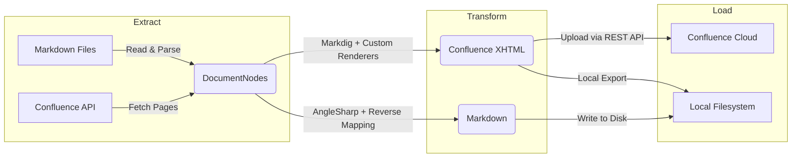

# ConfluentSynkMD

[](https://github.com/christopherdukart/ConfluentSynkMD/actions/workflows/ci.yml)
[](https://codecov.io/gh/christopherdukart/ConfluentSynkMD)
[](LICENSE)
[](https://christopherdukart.github.io/ConfluentSynkMD/)

**ConfluentSynkMD** is a .NET 10 CLI tool for bidirectional synchronization of Markdown documentation with Atlassian Confluence Cloud. It converts Markdown into Confluence Storage Format (XHTML) for upload, and Confluence pages back into Markdown for download — preserving directory-based hierarchy, rendering diagrams, and optimizing images.

## Why ConfluentSynkMD?

Keeping documentation in Markdown (version-controlled, editor-friendly) while publishing to Confluence (company wiki, stakeholder access) usually means manual copy-paste or fragile scripts. **ConfluentSynkMD** bridges that gap with a single CLI command: write in Markdown, publish to Confluence, download changes back — fully automated and round-trip safe.

---

## Features

- **Bidirectional Sync** — Upload Markdown → Confluence, Download Confluence → Markdown, or Local Export without API calls
- **Hierarchical Pages** — Preserves your local directory structure as a parent–child page tree in Confluence (`--keep-hierarchy`)
- **Diagram Rendering** — Converts Mermaid, Draw.io, PlantUML, and LaTeX code blocks into image attachments
- **Image Optimization** — Automatically downscales and compresses images before upload
- **GitHub Alerts** — Maps `[!NOTE]`, `[!WARNING]`, `[!TIP]`, `[!IMPORTANT]`, `[!CAUTION]` blocks to Confluence macros
- **Frontmatter Support** — Reads YAML frontmatter for page titles, tags/labels, Confluence Page IDs, **per-document `space_key`** override, per-document `generated_by` overrides, and layout options
- **Code Blocks** — Converts fenced code blocks with syntax highlighting, optional line numbers (`--code-line-numbers`), and language validation
- **Attachments** — Uploads local image and file references as Confluence attachments
- **Skip Unchanged** — Detects content hashes to skip re-uploading pages that haven't changed (`--skip-update`)
- **Page-ID Write-Back** — Writes `<!-- confluence-page-id: ... -->` comments back into Markdown sources after upload for round-trip sync
- **Round-Trip Fidelity** — Persists `source-path` metadata during upload, enabling exact directory structure reconstruction on download
- **Collision Safety** — Duplicate title detection and ancestor verification prevent accidental overwrites of unrelated pages
- **Debug Traceability** — `--debug-line-markers` includes source line numbers in conversion error messages
- **Flexible Auth** — Supports both Basic (email + API token) and Bearer (OAuth 2.0) authentication

---

## 📖 Documentation

Full documentation is available at **[christopherdukart.github.io/ConfluentSynkMD](https://christopherdukart.github.io/ConfluentSynkMD/)**.

| Section | Description |
|---|---|
| **Quick Start** | Get up and running in 5 minutes |
| **User Guide** | Upload, download, local export, frontmatter, diagrams |
| **Developer Guide** | Architecture, ETL pipeline, Markdig renderers, contributing |
| **Admin Guide** | Installation, Docker, configuration, authentication, CI/CD |
| **CLI Reference** | All 35+ command-line options documented |

> Available in **English** and **Deutsch**.

---

## Prerequisites

- **.NET 10 SDK** (to build and run locally)
- **Node.js 22+** and **@mermaid-js/mermaid-cli** (for Mermaid rendering)
- **Docker** (recommended for a consistent environment with all dependencies)

---

## Quick Start

```bash
# Clone and build
git clone https://github.com/christopherdukart/ConfluentSynkMD.git
cd ConfluentSynkMD
dotnet build

# Upload a documentation folder to Confluence
dotnet run --project src/ConfluentSynkMD -- \
  --mode Upload \
  --path ./docs \
  --conf-space YOUR_SPACE_KEY \
  --conf-parent-id YOUR_PAGE_ID

# Download Confluence pages back to Markdown
dotnet run --project src/ConfluentSynkMD -- \
  --mode Download \
  --path ./output \
  --conf-space YOUR_SPACE_KEY \
  --conf-parent-id YOUR_PAGE_ID

# Download a specific subtree by root page title
dotnet run --project src/ConfluentSynkMD -- \
  --mode Download \
  --path ./output \
  --conf-space YOUR_SPACE_KEY \
  --root-page "My Documentation"

# Local export only (no API calls)
dotnet run --project src/ConfluentSynkMD -- \
  --mode Upload \
  --path ./docs \
  --conf-space YOUR_SPACE_KEY \
  --local
```

---

## Configuration

The tool reads Confluence connection settings from **environment variables** or **CLI flags**. CLI flags take highest priority.

### Environment Variables

| Variable | Description | Default |
| :--- | :--- | :---: |
| `CONFLUENCE__BASEURL` | Confluence Cloud URL (e.g. `https://yoursite.atlassian.net`) | — |
| `CONFLUENCE__AUTHMODE` | `Basic` or `Bearer` | `Basic` |
| `CONFLUENCE__USEREMAIL` | Atlassian account email (Basic Auth) | — |
| `CONFLUENCE__APITOKEN` | Atlassian API Token (Basic Auth) | — |
| `CONFLUENCE__BEARERTOKEN` | OAuth 2.0 access token (Bearer Auth) | — |
| `CONFLUENCE__OPTIMIZEIMAGES` | Downscale images before upload | `true` |
| `CONFLUENCE__MAXIMAGEWIDTH` | Maximum width for optimized images (px) | `1280` |
| `CONFLUENCE__APIPATH` | API path prefix (`/wiki` for Cloud, empty for Data Center) | `/wiki` |
| `CONFLUENCE__APIVERSION` | REST API version (`v1` or `v2`) | `v2` |

### CLI Credential Flags

Credential settings can also be passed via CLI flags (overrides environment variables):

| Flag | Overrides | Description |
| :--- | :--- | :--- |
| `--conf-base-url` | `CONFLUENCE__BASEURL` | Confluence Cloud base URL |
| `--conf-auth-mode` | `CONFLUENCE__AUTHMODE` | Authentication mode: `Basic` or `Bearer` |
| `--conf-user-email` | `CONFLUENCE__USEREMAIL` | User email (Basic Auth) |
| `--conf-api-token` | `CONFLUENCE__APITOKEN` | API token (Basic Auth) |
| `--conf-bearer-token` | `CONFLUENCE__BEARERTOKEN` | Bearer token (OAuth 2.0) |

> **Tip:** For local development, you can still use a `.env` file with `CONFLUENCE__*` variables. However, the tool no longer auto-loads `.env` — you need to source it manually (e.g. `export $(cat .env | xargs)` on Linux/macOS, or `Get-Content .env | ForEach-Object { $k,$v = $_ -split '=',2; [System.Environment]::SetEnvironmentVariable($k,$v) }` on PowerShell).

---

## CLI Reference

```
ConfluentSynkMD – Markdown ↔ Confluence Synchronization Tool
```

### Core Options

| Option | Required | Default | Description |
| :--- | :---: | :---: | :--- |
| `--mode <Upload\|Download\|LocalExport>` | ✅ | — | Synchronization direction |
| `--path <path>` | ✅ | — | Local filesystem path to Markdown files |
| `--conf-space <key>` | ✅ | — | Confluence Space Key (e.g. `DEV`) |
| `--conf-parent-id <id>` | | — | Parent page ID for subtree operations |

### Sync Control

| Option | Default | Description |
| :--- | :---: | :--- |
| `--root-page <title>` | — | Root page title to upload under (alternative to `--conf-parent-id`; created if not found) |
| `--keep-hierarchy` | `true` | Preserve local directory hierarchy in Confluence |
| `--skip-hierarchy` | `false` | Flatten all pages under the root (overrides `--keep-hierarchy`) |
| `--skip-update` | `false` | Skip uploading pages whose content has not changed |
| `--local` | `false` | Only produce local Confluence Storage Format output, no API calls |
| `--no-write-back` | `false` | Don't write `<!-- confluence-page-id -->` / `<!-- confluence-space-key -->` comments back into Markdown sources after upload |
| `--loglevel <level>` | `info` | Logging verbosity: `debug`, `info`, `warning`, `error`, `critical` |

### Credential Options

| Option | Default | Description |
| :--- | :---: | :--- |
| `--conf-base-url <url>` | — | Confluence Cloud base URL (overrides `CONFLUENCE__BASEURL`) |
| `--conf-auth-mode <Basic\|Bearer>` | — | Authentication mode (overrides `CONFLUENCE__AUTHMODE`) |
| `--conf-user-email <email>` | — | User email for Basic auth (overrides `CONFLUENCE__USEREMAIL`) |
| `--conf-api-token <token>` | — | API token for Basic auth (overrides `CONFLUENCE__APITOKEN`) |
| `--conf-bearer-token <token>` | — | Bearer token for OAuth 2.0 (overrides `CONFLUENCE__BEARERTOKEN`) |

### API Settings

| Option | Default | Description |
| :--- | :---: | :--- |
| `--api-version <v1\|v2>` | `v2` | Confluence REST API version |
| `--headers <KEY=VALUE>` | — | Custom HTTP headers (can specify multiple) |

### Converter Options

| Option | Default | Description |
| :--- | :---: | :--- |
| `--heading-anchors` | `false` | Inject anchor macros before headings for deep-linking |
| `--force-valid-url` | `false` | Sanitize and escape invalid URLs |
| `--skip-title-heading` | `false` | Omit the first H1 heading (used as page title) |
| `--prefer-raster` | `false` | Prefer raster images over vector (SVG → PNG) |
| `--webui-links` | `false` | Render internal `.md` links as Confluence Web UI URLs |
| `--webui-link-strategy <space-title\|page-id>` | `space-title` | Strategy for Web UI links: title-based URL or page-id-based URL (with automatic fallback) |
| `--use-panel` | `false` | Use panel macro instead of info/note/warning for alerts |
| `--force-valid-language` | `false` | Validate code block languages against Confluence-supported set |
| `--code-line-numbers` | `false` | Show line numbers in Confluence code block macros (alias: `--line-numbers`) |
| `--debug-line-markers` | `false` | Include source line numbers in conversion error messages for debugging |
| `--title-prefix <prefix>` | — | Prefix prepended to all page titles (e.g. `[AUTO] `) |
| `--generated-by <value>` | `MARKDOWN` | Generated-by marker rendered as Confluence info macro. Supports template placeholders: `%{filepath}`, `%{filename}`, `%{filedir}`, `%{filestem}`. Can be overridden per-document via frontmatter. Set to empty to disable |

### Diagram Rendering

| Option | Default | Description |
| :--- | :---: | :--- |
| `--render-mermaid` | `true` | Render Mermaid code blocks as image attachments |
| `--no-render-mermaid` | `false` | Disable Mermaid rendering |
| `--render-drawio` | `false` | Render Draw.io code blocks as image attachments |
| `--render-plantuml` | `false` | Render PlantUML code blocks as image attachments |
| `--render-latex` | `false` | Render LaTeX code blocks as image attachments |
| `--diagram-output-format` | `png` | Output format for rendered diagrams: `png` or `svg` |

### Layout Options

| Option | Default | Description |
| :--- | :---: | :--- |
| `--layout-image-alignment` | — | Image alignment: `center`, `left`, `right` |
| `--layout-image-max-width <px>` | — | Maximum width for images in pixels |
| `--layout-table-width <px>` | — | Table width in pixels |
| `--layout-table-display-mode` | `responsive` | Table display mode: `responsive` or `fixed` |
| `--layout-alignment` | — | Content alignment: `center`, `left`, `right` |

---

## Docker Usage

The Docker image comes pre-packaged with .NET, Node.js, and mermaid-cli.

### Build

```bash
docker build -t confluentsynkmd .
```

### Run (PowerShell / Windows)

```powershell
# Upload (local development, optional): use --env-file
# Run this command from the directory that contains .env
docker run --rm -it `
  --env-file ./.env `
  -v ${PWD}/docs:/workspace/docs:ro `
  confluentsynkmd `
  --mode Upload `
  --path /workspace/docs `
  --conf-space YOUR_SPACE_KEY `
  --conf-parent-id YOUR_PAGE_ID

# Download (local development, optional): separate writable output mount
docker run --rm -it `
  --env-file ./.env `
  -v ${PWD}/output:/workspace/output `
  confluentsynkmd `
  --mode Download `
  --path /workspace/output `
  --conf-space YOUR_SPACE_KEY `
  --conf-parent-id YOUR_PAGE_ID

# Upload (CI/CD recommended): inject secrets from your pipeline variables
# Example uses environment variables already present in runner context
docker run --rm -it `
  -e CONFLUENCE__BASEURL `
  -e CONFLUENCE__AUTHMODE `
  -e CONFLUENCE__USEREMAIL `
  -e CONFLUENCE__APITOKEN `
  -v ${PWD}/docs:/workspace/docs:ro `
  confluentsynkmd `
  --mode Upload `
  --path /workspace/docs `
  --conf-space YOUR_SPACE_KEY `
  --conf-parent-id YOUR_PAGE_ID

# Download (CI/CD recommended): writable output mount
docker run --rm -it `
  -e CONFLUENCE__BASEURL `
  -e CONFLUENCE__AUTHMODE `
  -e CONFLUENCE__USEREMAIL `
  -e CONFLUENCE__APITOKEN `
  -v ${PWD}/output:/workspace/output `
  confluentsynkmd `
  --mode Download `
  --path /workspace/output `
  --conf-space YOUR_SPACE_KEY `
  --conf-parent-id YOUR_PAGE_ID
```

> [!IMPORTANT]
> If you mount `${PWD}`, make sure you run the command from the correct project directory. Prefer mounting only the required folders/files.

### Mount Strategies & Working Directory

| Mount | Use case |
| :--- | :--- |
| `-v ${PWD}/docs:/workspace/docs:ro` | Preferred for upload: least-privilege docs-only mount |
| `-v ${PWD}/docs:/workspace/docs:ro` + additional mounts (e.g. `-v ${PWD}/img:/workspace/img:ro`) | Use when Markdown references assets outside the docs folder |
| `-v ${PWD}:/workspace` | Full workspace mount (fallback), only when many cross-folder references are required |

> [!NOTE]
> For CI/CD, prefer secret stores (GitHub/GitLab protected variables). Keep `--env-file` as a local development option.

> [!TIP]
> Paths with spaces should be quoted in shell-specific syntax, e.g. PowerShell: `-v "${PWD}/my docs:/workspace/docs:ro"`.

> [!NOTE]
> The PowerShell mount syntax with space-containing paths was validated against the Docker image. Bash syntax should be validated in your target CI runner.

---

## Finding Confluence IDs

### Space Key

The `--conf-space` value is the **Space Key** (a short identifier), not the display name.

1. Navigate to your Confluence space → **Space Settings**
2. The Space Key is shown on the settings page (e.g. `MFS`, `DEV`)
3. Or extract it from the URL: `https://yoursite.atlassian.net/wiki/spaces/MFS/...` → key is `MFS`

> [!IMPORTANT]
> **Personal spaces** have long keys starting with `~` followed by an account ID, e.g. `~ACCOUNT_ID`. Find the key in the URL or via the REST API: `GET /wiki/api/v2/spaces`.

### Page ID

The `--conf-parent-id` is the numeric ID of an existing Confluence page.

1. Open the page in Confluence
2. Extract from the URL: `…/pages/123456/My+Page` → Page ID is `123456`
3. Or click the **page menu (⋯)** → **Page Information**

### Per-Document Space Key Override

By default, all pages are uploaded to the space specified via `--conf-space`.
You can override this per document using YAML frontmatter or inline HTML comments:

**YAML frontmatter:**
```yaml
---
space_key: TEAM
---
```

**Inline HTML comment:**
```html
<!-- confluence-space-key: TEAM -->
```

When set, the document will be created/updated in the specified space instead of the global one.
The write-back comment (`<!-- confluence-space-key: ... -->`) reflects the actual space used.

---

## Architecture

ConfluentSynkMD follows an **ETL (Extract-Transform-Load)** pipeline pattern:



| Layer | Responsibility |
|---|---|
| **Configuration** | CLI parsing, settings records (`ConfluenceSettings`, `ConverterOptions`, `LayoutOptions`) |
| **ETL / Extract** | Markdown file ingestion, Confluence page fetching, frontmatter parsing |
| **ETL / Transform** | Markdown → XHTML conversion (Markdig pipeline with custom renderers), XHTML → Markdown reverse conversion |
| **ETL / Load** | Confluence API upload, filesystem download, local export |
| **Services** | API client, hierarchy resolver, diagram renderers (Mermaid, PlantUML, Draw.io, LaTeX), image optimizer, link resolver |
| **Markdig** | Custom renderers for headings, code blocks, images, links, alerts, tables, etc. |
| **Models** | Domain models (`DocumentNode`, `ConvertedDocument`, `PageInfo`, etc.) |

---

## Limitations

- **Confluence Cloud only** — Tested against Confluence Cloud REST API v2. Data Center / Server may work with `--api-version v1` and `--api-path ""`, but is not officially supported.
- **No incremental download** — Download always fetches the full subtree; there is no delta sync in download mode.
- **Diagram rendering requires external tools** — Mermaid needs Node.js + `@mermaid-js/mermaid-cli`, PlantUML needs a `plantuml` binary, Draw.io needs `drawio-export`. The Docker image includes Mermaid only.
- **No concurrent uploads** — Pages are uploaded sequentially to respect Confluence API rate limits and parent–child ordering.
- **Markdown fidelity** — Not all Confluence macros have a Markdown equivalent. Download mode maps common structures but may lose macro-specific formatting.
- **Single-space hierarchy** — `--keep-hierarchy` builds the page tree within a single space. Cross-space hierarchies are not supported (though individual documents can target different spaces via frontmatter).

---

## Project Structure

```
ConfluentSynkMD/
├── src/ConfluentSynkMD/           # Main application
│   ├── Configuration/             # Settings records (ConfluenceSettings, ConverterOptions, LayoutOptions)
│   ├── ETL/                       # Extract-Transform-Load pipeline
│   │   ├── Core/                  # Pipeline runner, step interfaces, batch context
│   │   ├── Extract/               # Markdown ingestion, Confluence page ingestion
│   │   ├── Transform/             # Markdown→XHTML and XHTML→Markdown conversion
│   │   └── Load/                  # Upload to Confluence, download to filesystem, local export
│   ├── Markdig/                   # Custom Markdig renderers (headings, code, images, links, alerts…)
│   ├── Models/                    # Domain models (DocumentNode, ConvertedDocument, etc.)
│   └── Services/                  # API client, hierarchy resolver, diagram renderers, image optimizer
├── tests/ConfluentSynkMD.Tests/   # Unit and integration tests (xUnit)
├── Dockerfile                     # Multi-stage Docker build
└── .env.example                   # Template for environment variables
```

---

## Development & Testing

```bash
# Build
dotnet build

# Run all tests
dotnet test

# Run with verbose output
dotnet test --verbosity normal
```

The test suite includes unit and integration tests. Diagram rendering integration tests that require external tools (`mmdc`, `plantuml`) are skipped by default.

### Round-Trip / Integration Tests

Round-trip behavior is covered by integration tests in `tests/ConfluentSynkMD.Tests/Integration`.

```bash
# Run integration tests only
dotnet test --filter "Category=Integration"
```

These tests validate core round-trip guarantees such as heading extraction, path parity checks, and markdown/XHTML transform behavior.

> [!NOTE]
> Some round-trip assertions are fixture-dependent and are skipped automatically when optional local test folders are not present.

---

## Contributing

Contributions are welcome! Please see [CONTRIBUTING.md](CONTRIBUTING.md) for guidelines, and read our [Code of Conduct](CODE_OF_CONDUCT.md) before participating.

For security issues, please refer to [SECURITY.md](SECURITY.md).

## Community & Governance

- Contribution guide: [CONTRIBUTING.md](CONTRIBUTING.md)
- Code of Conduct: [CODE_OF_CONDUCT.md](CODE_OF_CONDUCT.md)
- Security policy: [SECURITY.md](SECURITY.md)
- Support: [SUPPORT.md](SUPPORT.md)
- Changelog: [CHANGELOG.md](CHANGELOG.md)

---

## License

[MIT](LICENSE)
