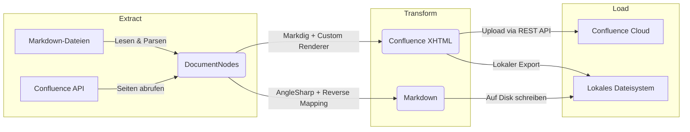

# Architektur

ConfluentSynkMD folgt einem **ETL (Extract-Transform-Load)** Pipeline-Muster. Jede Sync-Operation durchläuft die gleiche dreistufige Pipeline.

---

## Datenfluss



---

## Layer

| Layer | Verantwortlichkeit | Schlüsselklassen |
|---|---|---|
| **Configuration** | CLI-Parsing, Einstellungs-Records | `ConfluenceSettings`, `ConverterOptions`, `LayoutOptions`, `SyncOptions` |
| **ETL / Extract** | Datei-Ingestion, API-Abruf, Frontmatter-Parsing | `MarkdownIngestionStep`, `ConfluenceIngestionStep` |
| **ETL / Transform** | Markdown ↔ XHTML-Konvertierung | `ConfluenceXhtmlTransformStep`, `MarkdownTransformStep` |
| **ETL / Load** | API-Upload, Dateisystem-Schreiben, lokaler Export | `ConfluenceLoadStep`, `FileSystemLoadStep`, `LocalOnlyLoadStep`, `WriteBackStep` |
| **Services** | Querschnittsfunktionen | `ConfluenceApiClient`, `HierarchyResolver`, `MermaidRenderer`, `ImageOptimizer` |
| **Markdig** | Benutzerdefinierte Markdig-Renderer | `ConfluenceRenderer`, 18+ individuelle Renderer |
| **Models** | Domänenobjekte | `DocumentNode`, `ConvertedDocument`, `PageInfo` |

---

## Pipeline-Komposition

=== "Upload"

    ```
    MarkdownIngestionStep → ConfluenceXhtmlTransformStep → ConfluenceLoadStep → WriteBackStep
    ```

=== "Download"

    ```
    ConfluenceIngestionStep → MarkdownTransformStep → FileSystemLoadStep
    ```

=== "LocalExport"

    ```
    MarkdownIngestionStep → ConfluenceXhtmlTransformStep → LocalOnlyLoadStep
    ```

---

## Design-Entscheidungen

1. **ETL statt prozedural** — Jeder Schritt hat eine klar definierte Verantwortlichkeit
2. **Markdig für Parsing** — Bewährter .NET Markdown-Parser mit Erweiterungssupport
3. **AngleSharp für Reverse** — Vollständiger HTML-DOM-Parser für XHTML → Markdown
4. **Serilog für Logging** — Strukturiertes Logging mit konfigurierbarer Verbosität
5. **System.CommandLine** — Typsicheres CLI-Parsing mit automatischer Hilfe
