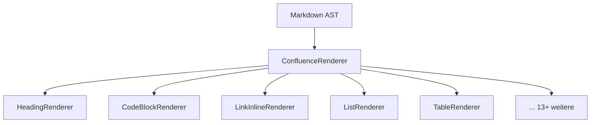

# Markdig-Renderer

ConfluentSynkMD verwendet **Markdig** als Markdown-Parser und erweitert ihn mit benutzerdefinierten Renderern, die Confluence Storage Format (XHTML) statt Standard-HTML erzeugen.

---

## Funktionsweise

Der `ConfluenceRenderer` registriert individuelle Renderer für jeden Markdown-Elementtyp:

---

## Verfügbare Renderer

| Renderer | Verarbeitet | Confluence-Output |
|---|---|---|
| `HeadingRenderer` | `#` Überschriften | `<h1>`–`<h6>` mit optionalen Ankern |
| `CodeBlockRenderer` | Fenced Code Blocks | `<ac:structured-macro ac:name="code">` |
| `LinkInlineRenderer` | `[Text](URL)` Links | `<ac:link>` oder Web-UI-URLs |
| `TableRenderer` | Markdown-Tabellen | `<table>` mit Layout-Optionen |
| `QuoteBlockRenderer` | Blockquotes / Alerts | Info/Note/Warning-Makros |
| `EmphasisInlineRenderer` | `*kursiv*` / `**fett**` | `<em>` / `<strong>` |

---

## Neuen Renderer hinzufügen

1. Renderer-Klasse in `src/ConfluentSynkMD/Markdig/Renderers/` erstellen
2. In `ConfluenceRenderer.cs` registrieren
3. Tests hinzufügen

---

## GitHub Alerts → Confluence-Makros

| Markdown | Confluence-Makro |
|---|---|
| `> [!NOTE]` | `<ac:structured-macro ac:name="info">` |
| `> [!WARNING]` | `<ac:structured-macro ac:name="warning">` |
| `> [!TIP]` | `<ac:structured-macro ac:name="tip">` |
| `> [!IMPORTANT]` | `<ac:structured-macro ac:name="note">` |
| `> [!CAUTION]` | `<ac:structured-macro ac:name="warning">` |

Verwenden Sie `--use-panel`, um alle Alerts als Panel-Makros darzustellen.
