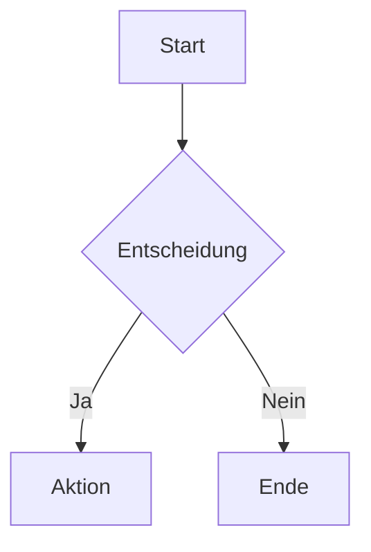

# Diagramm-Rendering

ConfluenceSynkMD kann Code-Blöcke verschiedener Diagramm-Sprachen in Bild-Anhänge rendern, die in Ihre Confluence-Seiten eingebettet werden.

---

## Unterstützte Diagrammtypen

| Typ | Flag | Standard | Externes Tool |
|---|---|---|---|
| **Mermaid** | `--render-mermaid` | ✅ Aktiviert | `@mermaid-js/mermaid-cli` (Node.js) |
| **Draw.io** | `--render-drawio` | ❌ Deaktiviert | `drawio-export` |
| **PlantUML** | `--render-plantuml` | ❌ Deaktiviert | `plantuml`-Binary |
| **LaTeX** | `--render-latex` | ❌ Deaktiviert | LaTeX-Distribution |

---

## Mermaid

Mermaid ist standardmäßig aktiviert:

````markdown

````

### Voraussetzungen

- Node.js 22+
- mermaid-cli installieren: `npm install -g @mermaid-js/mermaid-cli`

### Mermaid deaktivieren

```bash
--no-render-mermaid
```

---

## Draw.io

```bash
--render-drawio
```

---

## PlantUML

```bash
--render-plantuml
```

---

## LaTeX

```bash
--render-latex
```

---

## Ausgabeformat

```bash
--diagram-output-format png   # Standard
--diagram-output-format svg
```

!!! tip
    Verwenden Sie `--prefer-raster`, um Raster-Output (PNG) zu erzwingen.

---

## Docker

Das Docker-Image enthält standardmäßig Mermaid. Für andere Diagrammtypen erweitern Sie das Dockerfile.
