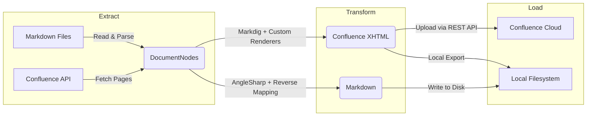

# Architecture

ConfluenceSynkMD follows an **ETL (Extract-Transform-Load)** pipeline pattern. Every sync operation — upload, download, or local export — flows through the same three-stage pipeline.

---

## High-Level Data Flow



---

## Layers

| Layer | Responsibility | Key Classes |
|---|---|---|
| **Configuration** | CLI parsing, settings records | `ConfluenceSettings`, `ConverterOptions`, `LayoutOptions`, `SyncOptions` |
| **ETL / Extract** | File ingestion, API fetching, frontmatter parsing | `MarkdownIngestionStep`, `ConfluenceIngestionStep` |
| **ETL / Transform** | Markdown ↔ XHTML conversion | `ConfluenceXhtmlTransformStep`, `MarkdownTransformStep` |
| **ETL / Load** | API upload, filesystem write, local export | `ConfluenceLoadStep`, `FileSystemLoadStep`, `LocalOnlyLoadStep`, `WriteBackStep` |
| **Services** | Cross-cutting concerns | `ConfluenceApiClient`, `HierarchyResolver`, `MermaidRenderer`, `ImageOptimizer`, `LinkResolver` |
| **Markdig** | Custom Markdig renderers | `ConfluenceRenderer`, 18+ individual renderers |
| **Models** | Domain objects | `DocumentNode`, `ConvertedDocument`, `PageInfo` |

---

## Pipeline Composition

The pipeline is composed differently depending on the sync mode:

=== "Upload"

    ```
    MarkdownIngestionStep
      → ConfluenceXhtmlTransformStep
        → ConfluenceLoadStep
          → WriteBackStep
    ```

=== "Download"

    ```
    ConfluenceIngestionStep
      → MarkdownTransformStep
        → FileSystemLoadStep
    ```

=== "LocalExport"

    ```
    MarkdownIngestionStep
      → ConfluenceXhtmlTransformStep
        → LocalOnlyLoadStep
    ```

---

## Dependency Injection

All services and pipeline steps are registered in `Program.cs` using `Microsoft.Extensions.DependencyInjection`. The `IHost` is built once, and pipeline steps are resolved from the DI container:

```csharp
builder.Services.AddTransient<MarkdownIngestionStep>();
builder.Services.AddTransient<ConfluenceXhtmlTransformStep>();
builder.Services.AddTransient<ConfluenceLoadStep>();
// ...
```

---

## Key Design Decisions

1. **ETL over procedural** — Each step has a single responsibility, making the pipeline testable and extensible
2. **Markdig for parsing** — Battle-tested .NET Markdown parser with extension support
3. **AngleSharp for reverse** — Full HTML DOM parser for accurate XHTML → Markdown conversion
4. **Serilog for logging** — Structured logging with configurable verbosity at runtime
5. **System.CommandLine** — Type-safe CLI parsing with auto-generated help
