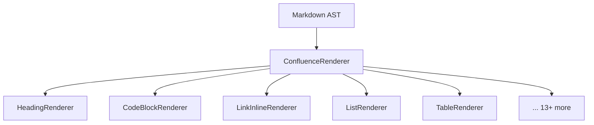

# Markdig Renderers

ConfluenceSynkMD uses **Markdig** as its Markdown parser and extends it with custom renderers that produce Confluence Storage Format (XHTML) instead of standard HTML.

---

## How It Works

The `ConfluenceRenderer` is a custom `IMarkdownRenderer` that replaces Markdig's default HTML output. It registers individual renderers for each Markdown element type:



---

## Available Renderers

| Renderer | Handles | Confluence Output |
|---|---|---|
| `HeadingRenderer` | `#` headings | `<h1>`–`<h6>` with optional anchor macros |
| `CodeBlockRenderer` | Fenced code blocks | `<ac:structured-macro ac:name="code">` |
| `CodeInlineRenderer` | Inline code | `<code>` |
| `LinkInlineRenderer` | `[text](url)` links | `<ac:link>` or Web UI URLs |
| `ListRenderer` | Ordered/unordered lists | `<ul>` / `<ol>` |
| `TableRenderer` | Markdown tables | `<table>` with layout options |
| `ParagraphRenderer` | Paragraphs | `<p>` |
| `EmphasisInlineRenderer` | `*italic*` / `**bold**` | `<em>` / `<strong>` |
| `QuoteBlockRenderer` | Blockquotes / Alerts | Info/Note/Warning macros |
| `ImageRenderer` | `` | `<ac:image>` with attachments |
| `ThematicBreakRenderer` | `---` | `<hr />` |
| `FootnoteRenderer` | Footnotes | Superscript references |
| `MathRenderer` | LaTeX math | Rendered images |
| `EmojiInlineRenderer` | `:emoji:` | Unicode / Confluence emoji |
| `MarkInlineRenderer` | `==highlight==` | `<mark>` |
| `HtmlBlockRenderer` | Raw HTML blocks | Pass-through |
| `HtmlInlineRenderer` | Inline HTML | Pass-through |
| `HtmlEntityInlineRenderer` | HTML entities | Entity resolution |
| `AutolinkInlineRenderer` | Auto-detected URLs | `<a>` links |
| `LiteralInlineRenderer` | Literal text | Text nodes |
| `LineBreakInlineRenderer` | Line breaks | `<br />` |

---

## Adding a New Renderer

1. **Create the renderer class** in `src/ConfluenceSynkMD/Markdig/Renderers/`:

```csharp
public class MyCustomRenderer : ConfluenceObjectRenderer<MyMarkdownObject>
{
    protected override void Write(
        ConfluenceRenderer renderer, MyMarkdownObject obj)
    {
        renderer.Write("<my-custom-output>");
        renderer.WriteChildren(obj);
        renderer.Write("</my-custom-output>");
    }
}
```

2. **Register it** in `ConfluenceRenderer.cs`:

```csharp
ObjectRenderers.Add(new MyCustomRenderer());
```

3. **Add tests** in the test project

---

## GitHub Alerts → Confluence Macros

A notable renderer feature is the conversion of GitHub-style alerts:

| Markdown | Confluence Macro |
|---|---|
| `> [!NOTE]` | `<ac:structured-macro ac:name="info">` |
| `> [!WARNING]` | `<ac:structured-macro ac:name="warning">` |
| `> [!TIP]` | `<ac:structured-macro ac:name="tip">` |
| `> [!IMPORTANT]` | `<ac:structured-macro ac:name="note">` |
| `> [!CAUTION]` | `<ac:structured-macro ac:name="warning">` |

Use `--use-panel` to render all alerts as panel macros instead.
