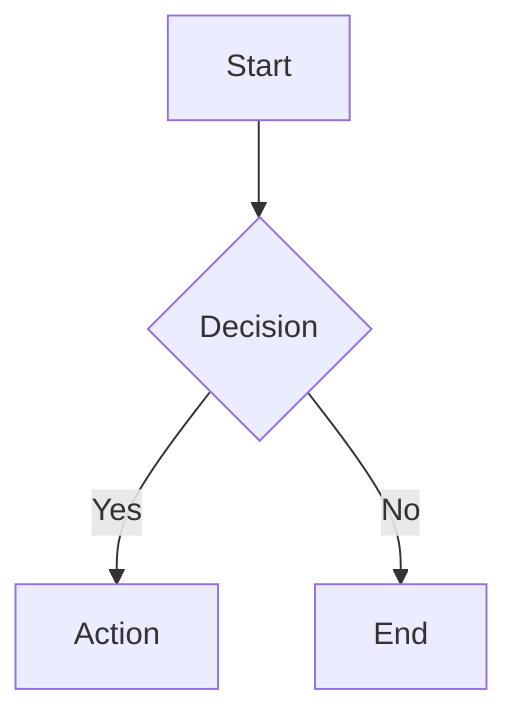
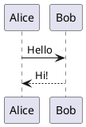

# Diagram Rendering

ConfluenceSynkMD can render code blocks for various diagram languages into image attachments that are embedded in your Confluence pages.

---

## Supported Diagram Types

| Type | Flag | Default | External Tool Required |
|---|---|---|---|
| **Mermaid** | `--render-mermaid` | ✅ Enabled | Docker Engine (`mermaid-cli` container) |
| **Draw.io** | `--render-drawio` | ❌ Disabled | `drawio-export` |
| **PlantUML** | `--render-plantuml` | ❌ Disabled | `plantuml` binary |
| **LaTeX** | `--render-latex` | ❌ Disabled | LaTeX distribution |

---

## Mermaid

Mermaid is enabled by default. Write standard Mermaid code blocks:

````markdown

````

### Prerequisites

- Docker Engine installed and running
- Docker executable available on your `PATH`

### Disable Mermaid

```bash
--no-render-mermaid
```

---

## Draw.io

Enable Draw.io rendering to convert Draw.io XML code blocks into images:

```bash
--render-drawio
```

````markdown
```drawio
<mxfile>...</mxfile>
```
````

### Prerequisites

Install `drawio-export` or use the Docker image which can be extended to include it.

---

## PlantUML

Enable PlantUML rendering:

```bash
--render-plantuml
```

````markdown

````

### Prerequisites

Install the `plantuml` binary and ensure it's on your `PATH`.

---

## LaTeX

Enable LaTeX rendering for mathematical formulas:

```bash
--render-latex
```

````markdown
```latex
E = mc^2
```
````

---

## Output Format

Control the output format for all rendered diagrams:

```bash
--diagram-output-format png   # Default
--diagram-output-format svg
```

!!! tip
    Use `--prefer-raster` to force raster output (PNG) even when the renderer produces SVG by default.

---

## Docker

The Docker image includes Mermaid by default. For other diagram types, extend the Dockerfile:

```dockerfile
# Example: Add PlantUML
RUN apt-get update && apt-get install -y plantuml
```
