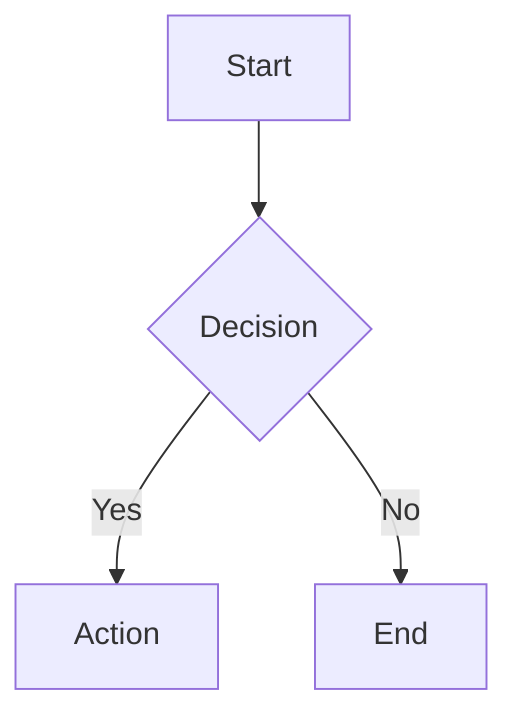
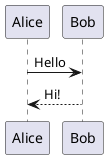

# Diagram Rendering

ConfluenceSynkMD can render code blocks for various diagram languages into image attachments that are embedded in your Confluence pages.

---

## Supported Diagram Types

| Type | Flag | Default | External Tool Required |
|---|---|---|---|
| **Mermaid** | `--render-mermaid` | ✅ Enabled | `@mermaid-js/mermaid-cli` (Node.js) |
| **Draw.io** | `--render-drawio` | ❌ Disabled | `drawio-desktop` (run headless via Xvfb) |
| **PlantUML** | `--render-plantuml` | ❌ Disabled | Java + the `plantuml` package |
| **LaTeX** | `--render-latex` | ❌ Disabled | LaTeX distribution + Ghostscript |

> **Running the published image?** All four renderers ship preinstalled in `ghcr.io/opendocsync/confluencesynkmd:0.1` — no host-side installation required. Run `docker run --rm ghcr.io/opendocsync/confluencesynkmd:0.1 doctor --renderers-only` to verify.

---

## Mermaid

Mermaid is enabled by default. Write standard Mermaid code blocks:

````markdown

```mermaid
graph TD
    A[Start] --> B{Decision}
    B -->|Yes| C[Action]
    B -->|No| D[End]
```
````

### Prerequisites

- Node.js 22+
- Install mermaid-cli: `npm install -g @mermaid-js/mermaid-cli`

### Disable Mermaid

```bash
--no-render-mermaid
```

---

## Draw.io

Enable Draw.io rendering to convert Draw.io XML code blocks into images:

```bash
--render-drawio
```

````markdown
```drawio
<mxfile>...</mxfile>
```
````

### Prerequisites

Install `drawio-desktop` (an Electron app) and arrange a display server (Xvfb on Linux). The simpler path is the published Docker image, which preinstalls drawio-desktop and starts Xvfb on `:99` for the container's lifetime via `entrypoint.sh`. To use it manually, set `DRAWIO_CMD` to a multi-token invocation:

```bash
export DRAWIO_CMD="xvfb-run -a drawio --no-sandbox --disable-gpu"
```

The `DrawioRenderer` parses multi-token env values via `RendererCommandResolver`.

---

## PlantUML

Enable PlantUML rendering:

```bash
--render-plantuml
```

````markdown

```plantuml
@startuml
Alice -> Bob: Hello
Bob --> Alice: Hi!
@enduml
```
````

### Prerequisites

Install the `plantuml` binary and ensure it's on your `PATH`.

---

## LaTeX

Enable LaTeX rendering for mathematical formulas:

```bash
--render-latex
```

````markdown
```latex
E = mc^2
```
````

---

## Output Format

Control the output format for all rendered diagrams:

```bash
--diagram-output-format png   # Default
--diagram-output-format svg
```

!!! tip
    Use `--prefer-raster` to force raster output (PNG) even when the renderer produces SVG by default.

---

## Docker

The Docker image includes Mermaid by default. For other diagram types, extend the Dockerfile:

```dockerfile
# Example: Add PlantUML
RUN apt-get update && apt-get install -y plantuml
```
